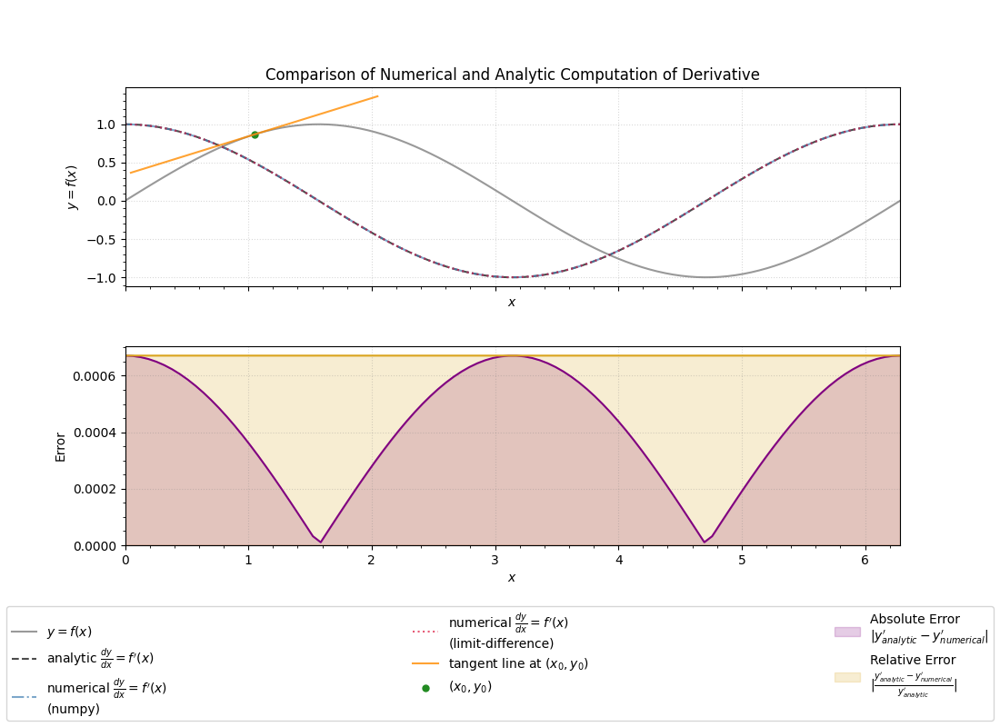
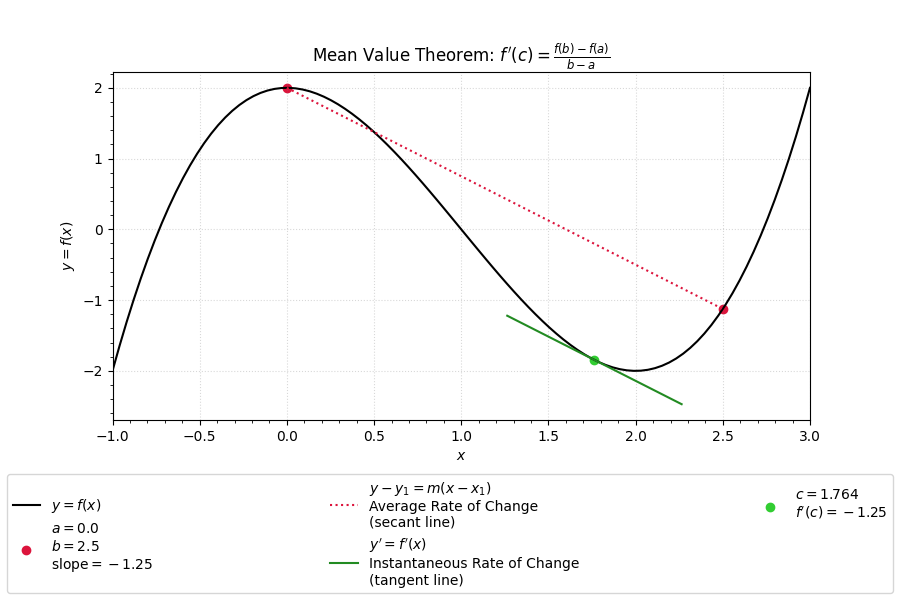
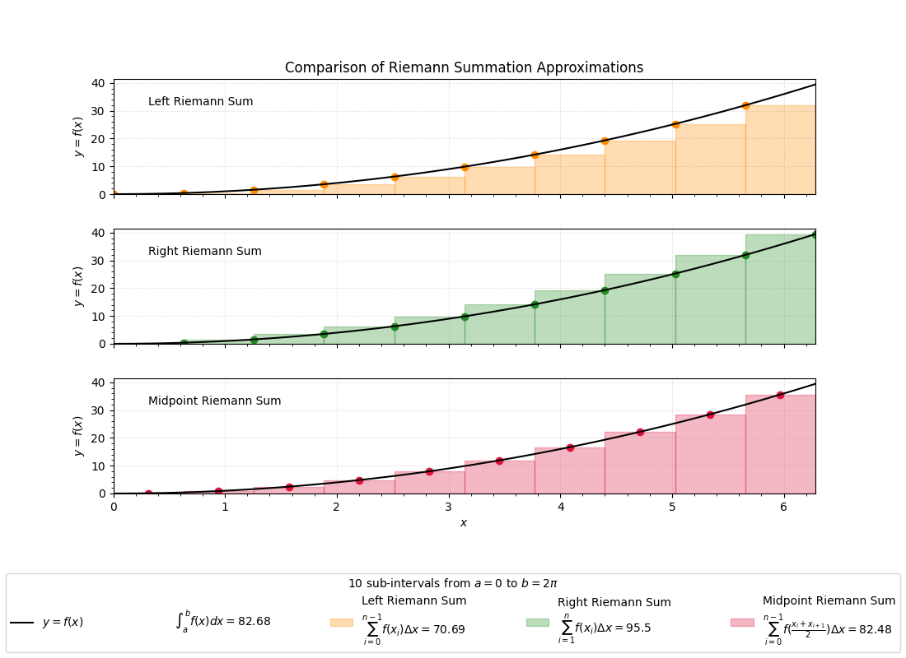

# Repo:    calculus

The purpose of this code is to make useful visualizations to help make calculus seem more intuitive.

## Description

## Getting Started

### Dependencies

* Python 3.9.6
* numpy == 1.26.4
* matplotlib == 3.9.4
* scipy == 1.13.1

### Executing program

* Download this repository to your local computer

* Modify `path_to_save_directory` and run example codes

## Version History

* 0.1
  * Initial Release

## License

This project is licensed under the Apache License - see the LICENSE file for details. 
